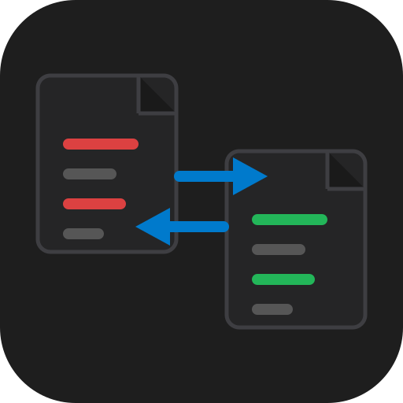

# MergeMate

<p align="center">
  
</p>

**Compara y fusiona código sin salir de una sola ventana, sin subir nada a la nube.**

---

## ¿Qué es?

MergeMate es una herramienta de escritorio para comparar y fusionar carpetas y
archivos de código. Abre dos carpetas completas y ve de un vistazo qué archivos
son idénticos, cuáles difieren y cuáles solo existen de un lado — o compara dos
archivos sueltos, dos imágenes, o simplemente pega código en un editor libre
para diffear al vuelo.

Todo corre localmente: no hay cuentas, no hay subida de archivos a un servidor,
no hay telemetría.

---

## ¿Por qué usarlo?

Revisar manualmente si dos versiones de un proyecto son "iguales" —antes de un
merge, una migración, o una entrega a un cliente— significa abrir carpeta por
carpeta y archivo por archivo. MergeMate hashea y clasifica todo el árbol de
una vez, y te muestra directamente dónde mirar: qué cambió de verdad y qué solo
cambió en comentarios o espacios en blanco.

---

## ¿Qué hace?

- **Tres modos de comparación** — carpetas completas, dos archivos individuales o editor libre para pegar código directamente
- **Visor de diferencias** — Monaco Editor lado a lado con navegación entre bloques y capacidades de fusión
- **Visor de imágenes** — slider, zoom, lado a lado y vista individual; soporta PNG, JPG, SVG, WebP y más
- **Historial de comparaciones recientes** — hasta 8 entradas con reapertura automática en el modo correcto
- **Interfaz en 5 idiomas** — español, inglés, alemán, francés y portugués con detección automática del OS

[Ver el detalle completo de funcionalidades →](FEATURES.md)

---

## ¿Para quién es?

- **Desarrolladores** que necesitan confirmar que un merge, un fork o una migración no rompió nada
- **Revisores de código** que quieren ver diferencias reales sin ruido de formato o comentarios
- **Cualquiera** que necesite comparar dos versiones de una carpeta o un par de imágenes sin instalar un IDE completo

---

## Privacidad y datos

- **Todo el procesamiento es local.** El hash y la clasificación de archivos corren en tu máquina.
- **Sin telemetría.** La app no reporta uso ni contenido a ningún servidor.
- **Sin cuentas, sin login.** Abrís la app, seleccionás las carpetas o archivos, listo.
- La única conexión de red es la verificación silenciosa de actualizaciones contra GitHub Releases.

---

## Instalación

MergeMate se distribuye como instalador para Windows (NSIS), macOS (DMG) y Linux (AppImage).

```bash
npm install
npm run dev          # modo desarrollo
npm run dist:win     # instalador de Windows
```

Ver [TECHNICAL.md](TECHNICAL.md) para requisitos, todos los comandos de build y el detalle de CI.

---

## Documentación técnica

¿Buscás el stack, la arquitectura del proyecto o cómo compilarlo? Mirá [**TECHNICAL.md**](TECHNICAL.md).

## Contribuir

El proyecto es de código abierto bajo licencia MIT. Los issues y PRs son bienvenidos — el idioma principal del repositorio (código, issues, discusiones) es el español.
